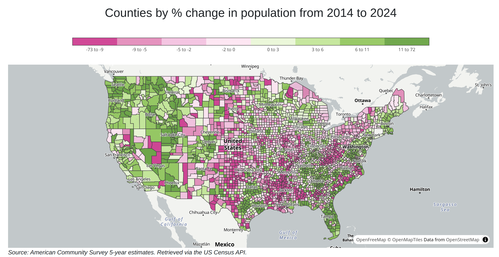
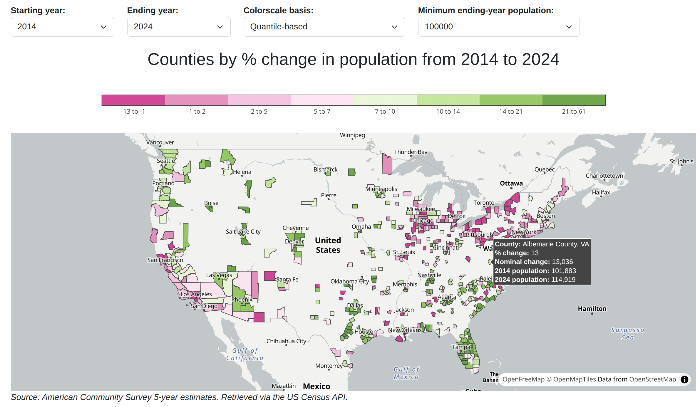
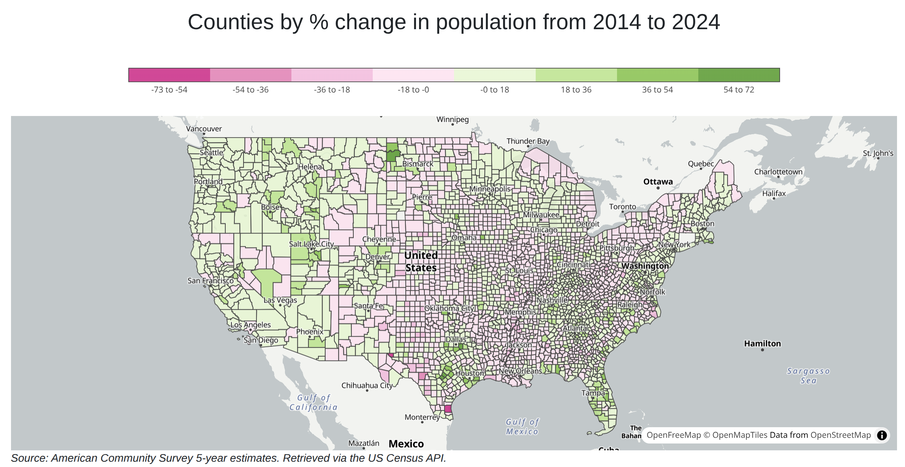

# County Growth Trends

By Ken Burchfiel

Released under the MIT License

[Click here](https://kburchfiel.github.io/county_growth_trends/county_growth_map.html) to view the population-growth dashboard stored within this repository.

*Note: I did not use generative AI tools to create this project.*

I often find that quantile-based scales work better than linear ones when visualizing choropleth map data. (After all, particularly high or low values can easily skew a linear range.)

Therefore, I put together a county-population-growth dashboard that allows growth rates to be viewed in either percentile-based or quantile-based form. The dashboard also lets users determine the starting and ending years for population growth calculations *and* set a minimum population size; the dashboard’s JavaScript code will then calculate new colorscales accordingly.

The dashboard also shows how to use Plotly.js's `hovertemplate` and `customdata` arguments to create custom tooltips that show data both from the map’s underlying GeoJSON data and the population-growth table that it imports.

Although I’ve enjoyed using Danfo.js for underlying data manipulation, that library hasn’t been updated in a little while, so I used d3-array for certain data-related tasks instead.

## Potential future updates

1. Allow an arbitrary number of bins to be specified by the user. (This will also require updating my color-palette code to create custom colors on the fly.)

2. Display rank and percentile information within the tooltips

3. Add data for additional years as it becomes available

4. Prevent users from choosing an ending year that is less than or equal to the starting year
 
## Screenshots

Default view: 

Filtered view showing only counties with 100K+ residents in 2024: 

Linear scale: 